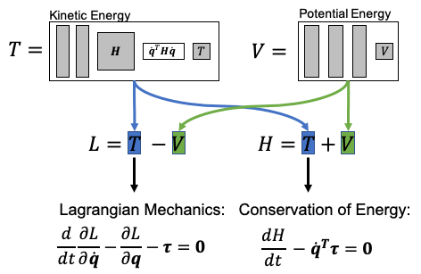
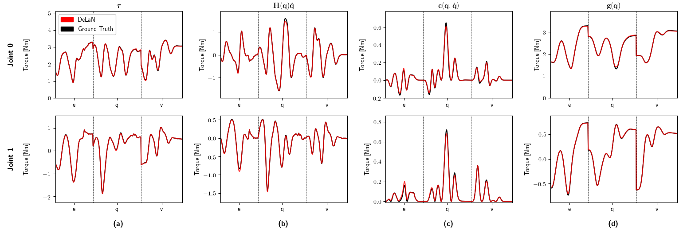

# Deep Lagrangian Networks
The open-source implementation of Deep Lagrangian Networks presented in
- [Lutter and Peters, (2021). Combining Physics and Deep Learning to learn Continuous-Time Dynamics Models, 
arXiv preprint arXiv:2110.01894](https://arxiv.org/abs/2110.01894).
 
- [Lutter et. al., (2019). Deep Lagrangian Networks: Using Physics as Model Prior for Deep Learning, 
International Conference on Learning Representations (ICLR)](https://arxiv.org/abs/1907.04490).

- [Lutter et. al., (2019). Deep Lagrangian Networks for end-to-end learning of energy-based control for under-actuated systems,
 International Conference on Intelligent Robots & Systems (IROS)](https://arxiv.org/abs/1907.04489).


**Abstract:** \
Models describing the dynamics of the robot and its environment are essential to achieve precise control as well as 
sample-efficient reinforcement learning.  Currently, engineers prefer manually engineered models due to the physical
plausibility and robust generalization despite their labor intensive development.  To learn models that are physically
plausible and achieve better generalization, we proposed Deep Lagrangian Networks (DeLaN). DeLaN uses the Euler-Lagrange
differential equation from Lagrangian mechanics to derive an optimization objective that guarantees physical plausible models.
Let $`V(\mathbf{q};\: \psi)`$ and $`T(\mathbf{q}, \dot{\mathbf{q}}; \: \psi)`$
be deep networks representing potential and kinetic energy, then the motor torques can be computed using the Euler-Lagrange 
differential equation and the network parameters can be learned by minimizing the residual between the predicted and 
measured torques. Therefore, the structured objective regularizes the learning to achieve noise robustness and enables 
the unsupervised learning of the system energies as well as gravitational, inertial and Coriolis forces. The retrieval 
of the interpretable energies and forces is especially remarkable as these quantities cannot be recovered with other 
grey- or black-box model learning approaches.

  

Figure 1: The network structure and loss of Deep Lagrangian Networks

**Example:** \
In this example, we apply Deep Lagrangian Networks to a simulated two degree of freedom robot. For training the robots
executes different trajectories resembling characters and records the trajectory as well as motor torques. The recorded 
trajectory data is then used to train Deep Lagrangian Networks using Adam. Thereby, DeLaN learns the force decomposition 
into inertial, Coriolis & centrifugal and gravitatonal forces unsupervised from the super-imposed torques. The force 
decomposition for testing characters not part of the training set is shown in Figure 2. DeLaN learns the true underlying
decomposition and achieves low mean squared error on the test data (Table 1). DeLaN is computationally efficient and 
achieves one-step prediction with an average frequency of 1500Hz. Therefore, DeLaN can be used in real-time control applications. 
```
                Torque MSE = 4.327e-04
              Inertial MSE = 7.338e-04
Coriolis & Centrifugal MSE = 2.227e-04
         Gravitational MSE = 7.338e-04
    Power Conservation MSE = 4.456e-05
      Comp Time per Sample = 6.590e-04s / 1517.4Hz
```
Table 1: The mean squared error of the learned force decomposition compared to the ground truth decomposition as well as 
the average computation time per sample on a AMD 3950 CPU.   

  

Figure 2: (a) The torque $`\bm{\tau}`$ required to generate the characters 'a', 'd' and 'e' in black. Using these samples \acronym was trained offline and learns the red trajectory. DeLaN can not only learn the desired torques but also disambiguate the individual torque components even though DeLaN was trained on the super-imposed torques. Using the Euler-Lagrange equation, the inertial force $`\mathbf{H}(\mathbf{q})\ddot{\mathbf{q}}`$ (b), the Coriolis and Centrifugal forces $`\mathbf{c}(\mathbf{q}, \dot{\mathbf{q}})`$ (c) and the gravitational force $`\mathbf{g}(\mathbf{q})`$ can be computed.

**Installation:** \
For installation this python package can be cloned and installed via pip
```
git clone https://github.com/milutter/deep_lagrangian_networks.git deep_lagrangian_networks
pip install deep_lagrangian_networks

python deep_lagrangian_networks/example_DeLaN.py -r 1
```

**Citation:** \
If you use this implementation within your paper, please cite:

```
@inproceedings{lutter2019deep,
  author =      "Lutter, M. and  Ritter, C. and  Peters, J.",
  year =        "2019",
  title =       "Deep Lagrangian Networks: Using Physics as Model Prior for Deep Learning",
  booktitle =   "International Conference on Learning Representations (ICLR)",
}

@inproceedings{lutter2019energy,
  author =      "Lutter, M. and  Listmann, K. and  Peters, J.",
  year =        "2019",
  title =       "Deep Lagrangian Networks for end-to-end learning of energy-based control for under-actuated systems",
  booktitle =   "International Conference on Intelligent Robots & Systems (IROS)",
}

@article{lutter2021combining,
  author =      "Lutter, M. abd Peters, P.",
  year =        "2021",
  title =       "Combining Physics and Deep Learning to learn Continuous-Time Dynamics Models",
  journal =     "arXiv preprint arXiv:2110.01894"
}

```

**Contact:** \
If you have any further questions or suggestions, feel free to reach out to me via
```michael AT robot-learning DOT de```

